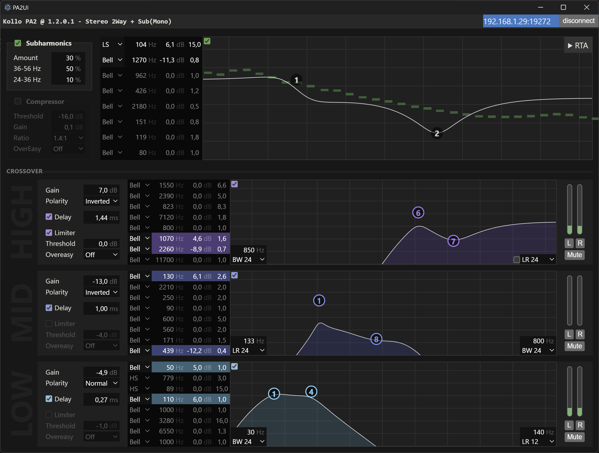

# PA2UI

> [!IMPORTANT]
> This project is not affiliated with DBX or Harman in any way. This is a personal project and I am not responsible for any damage caused by using this software. Use at your own risk.

A highly opinionated UI for the [DBX DriveRack PA2](https://dbxpro.com/en/products/driverack-pa2) (and possibly other HiQnet devices?) implementing a subset of the features available in the official PA2 Control-app. Intentionally built to have everything important visible at all times - essentially making a simple screenshot of the application act as a "single source of truth".

Pre-built binaries for Windows, Mac, and Linux can be found here: https://github.com/Kattjakt/pa2ui/releases

## features

- Automatic device discovery via UDP broadcast
- Parametric EQ
- RTA + Signal generator
- Output meters + mute
- Subharmonic Synth
- Compressor
- Crossover (LPF/HPF, PEQ, alignment delay, gain, polarity, limiter)
- Adjustable Q/Slope using scroll wheel
- Ableton-inspired input fields

## future stuff, maybe?

- Global delay
- Preset management (store and recall)
- Logging of input/output headroom over time
- Keyboard shortcuts for muting
- A/B-testing of parameters using configurable banks
- Less shit code

## things that won't be implemented

- Anything Wizard-related
- Auto EQ
- Graphic EQ
- Feedback suppression

## known issues

- The implementation of the crossover slope visualizations are misleading and needs a rewrite
